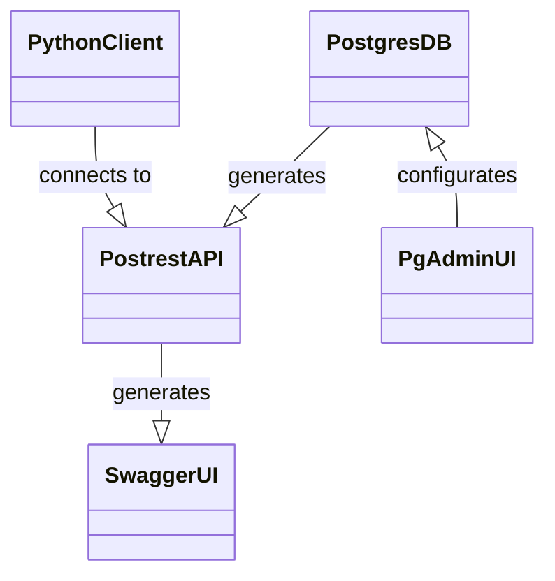

# HI ERN Database Postgres-Stack

Docker-Compose stack consisting of:
- [PostgreSQL](https://www.postgresql.org/)
- [PostgREST](https://postgrest.org/)
- [SwaggerUI](https://swagger.io/tools/swagger-ui/)
- [pgAdmin](https://www.pgadmin.org/)



PythonClient: https://git.hte.group/hierndatabase/hiern-database-pgstack-pyclient

## Config

```bash
cp .env.example .env
```
Set ENV values in `.env`

## Usage

```bash
docker compose up
```

## Cleanup

```bash
docker compose down -v
sudo rm -r postgres/data && sudo rm -r pgadmin/data
```

## Auth

### Static JWT

see: https://postgrest.org/en/v12/tutorials/tut1.html#step-2-make-a-secret
```bash
echo "jwt-secret = \"$(LC_ALL=C tr -dc 'A-Za-z0-9' </dev/urandom | head -c32)\""
```
goto https://jwt.io/ and sign token with header `{"alg": "HS256", "typ": "JWT"}` and payload `{"role": "api_user"}`

Example token: `Bearer eyJhbGciOiJIUzI1NiIsInR5cCI6IkpXVCJ9.eyJyb2xlIjoiYXBpX3VzZXIifQ.<signature>`

set the jwt-secret in your `.env` file: 
```env
PGRST_JWT_SECRET=aAdsdasd...
PGRST_ROLE_CLAIM_KEY='role'
```

### Keycloak
Go to `https://auth.<domain>/admin/master/console/#/master/realm-settings/keys`

Copy public key for RSA RS256 algorithm.

Wrap it in header/footer line and convert it via https://8gwifi.org/jwkconvertfunctions.jsp to a JWT.
Example:

```
-----BEGIN PUBLIC KEY-----
MIIBIjANBgkqhkiG9w0BAQEFAAOCAQ8AMIIBCgKCAQEA2WGSqwsD/8VS6CEPF7Bwknzk6u9SgdLoUtRYnyWlvAE4jDmx92ql4YEcGug+DXZy33EnpoL9mjSXrghuiKb1pNAI9sHcc863pkuBWm2S7/l/esJkTD8J1sUETfy4OH4IutjTmtwyHGhfi1rlI81a1E6vCcMNyh5vTCizjerHfP34jjXvnMHIDU4F51JmN9FVpwpKlk/2JXRyCesedTNiiPaHZXQDRltVQGputXClugyEs8o7y46RoieGlc6/FLPU1JJGlM7F52fOYmIjhDWzO54/PHlzVCGEpW5c8kxeLlBBfjaYyiSvLH5ScssmrjtD5+aqV8A9iKViZuu4zOQs1wIDAQAB
-----END PUBLIC KEY-----
```

```json
{"kty":"RSA","e":"AQAB","kid":"15f3d607-103c-49ec-9041-df9e0f9fa848","n":"2WGSqwsD_8VS6CEPF7Bwknzk6u9SgdLoUtRYnyWlvAE4jDmx92ql4YEcGug-DXZy33EnpoL9mjSXrghuiKb1pNAI9sHcc863pkuBWm2S7_l_esJkTD8J1sUETfy4OH4IutjTmtwyHGhfi1rlI81a1E6vCcMNyh5vTCizjerHfP34jjXvnMHIDU4F51JmN9FVpwpKlk_2JXRyCesedTNiiPaHZXQDRltVQGputXClugyEs8o7y46RoieGlc6_FLPU1JJGlM7F52fOYmIjhDWzO54_PHlzVCGEpW5c8kxeLlBBfjaYyiSvLH5ScssmrjtD5-aqV8A9iKViZuu4zOQs1w"}
```

Store the JWT in your .env file
```env
PGRST_JWT_SECRET={"kty":"RSA","e":"AQAB","kid": "abc..."}
PGRST_ROLE_CLAIM_KEY='.resource_access.postgrest.roles[0]'
```

### Client

Go to "clients" and create a new one with name `postgrest`.
Choose access type "public", and define the redirecturi to `https://login.<domain>` for now.

Set the following settings:
```
Type: OpenID Connect
Name: postgrest
Authentication: Off
Flow: Implicite flow + Device Auth Grant
```

Next define the role to access the POSTGREST-API and the corresponding user group:
1. Create Client role "api_user"
1. Create Group "api_users"
1. Assign role "api_user" to Group "api_users"

For testing, create the following ressources
1. Create user "testuser"
1. Set password "testpassword"
1. Let "testuser" join group "api_users"

Generated access token: see clients/postgrest/client_scopes/evaluate with testuser

```bash
curl  -X POST \
  'https://auth.pv.demo.open-semantic-lab.org/realms/master/protocol/openid-connect/token' \
  --header 'Accept: */*' \
  --header 'Content-Type: application/x-www-form-urlencoded' \
  --data-urlencode 'grant_type=password' \
  --data-urlencode 'client_id=postgrest' \
  --data-urlencode 'username=testuser' \
  --data-urlencode 'password=testpassword'
```
