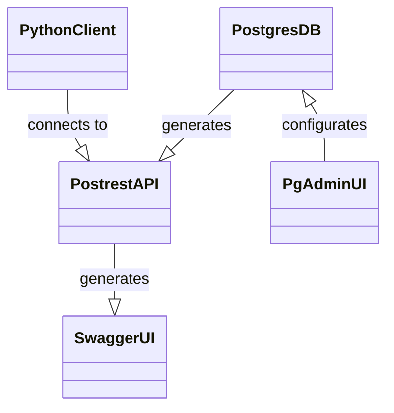

# HI ERN Database Postgres-Stack

Docker-Compose stack consisting of:
- [PostgreSQL](https://www.postgresql.org/)
- [PostgREST](https://postgrest.org/)
- [SwaggerUI](https://swagger.io/tools/swagger-ui/)
- [pgAdmin](https://www.pgadmin.org/)

