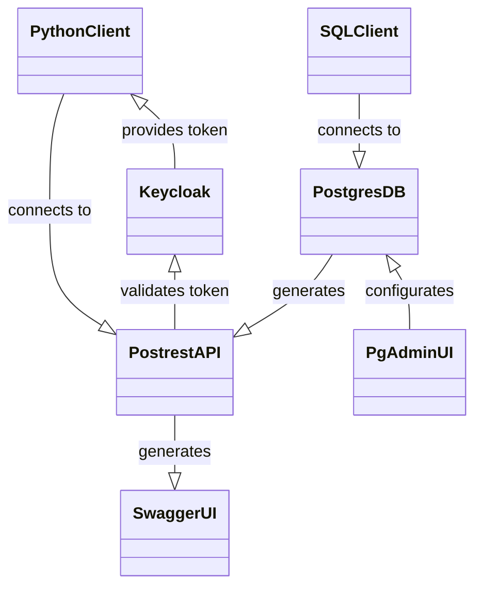

# Timescale-DB Postgres-Stack

Docker-Compose stack consisting of:
- [PostgreSQL](https://www.postgresql.org/)
- [PostgREST](https://postgrest.org/)
- [SwaggerUI](https://swagger.io/tools/swagger-ui/)
- [pgAdmin](https://www.pgadmin.org/)
- [Keycloak](https://www.keycloak.org/)




As reverse proxy, caddy is recommended. To use it, create the following docker compose within the same or a separate stack:
```yml
services:
  caddy:
    environment:
    - CADDY_INGRESS_NETWORKS=caddy
    image: lucaslorentz/caddy-docker-proxy:ci-alpine
    networks:
    - caddy
    ports:
    - 80:80
    - 443:443
    restart: unless-stopped
    volumes:
    - /var/run/docker.sock:/var/run/docker.sock
    - caddy_data:/data

volumes:
  caddy_data: {}
networks:
  caddy:
    external: true
``` 

In `docker-compose.example.override.yml` you can find the necessary definitions to expose the different containers via caddy.

## Config

```bash
cp .env.example .env
```
Set ENV values in `.env`

## Usage

```bash
docker compose up
```

## Cleanup

```bash
docker compose down -v
sudo rm -r postgres/data && sudo rm -r pgadmin/data
sudo mkdir pgadmin/data && sudo chown -R 5050:5050 pgadmin/data
mkdir pgadmin/config
```

## Auth

### Static JWT

see: https://postgrest.org/en/v12/tutorials/tut1.html#step-2-make-a-secret
```bash
echo "jwt-secret = \"$(LC_ALL=C tr -dc 'A-Za-z0-9' </dev/urandom | head -c32)\""
```
goto https://jwt.io/ and sign token with header `{"alg": "HS256", "typ": "JWT"}` and payload `{"role": "api_user"}`

Example token: `Bearer eyJhbGciOiJIUzI1NiIsInR5cCI6IkpXVCJ9.eyJyb2xlIjoiYXBpX3VzZXIifQ.<signature>`

set the jwt-secret in your `.env` file: 
```env
PGRST_JWT_SECRET=aAdsdasd...
PGRST_ROLE_CLAIM_KEY='role'
```

### Keycloak
Go to `https://auth.<domain>/admin/master/console/#/master/realm-settings/keys`

Copy public key for RSA RS256 algorithm.

Wrap it in header/footer line and convert it via https://8gwifi.org/jwkconvertfunctions.jsp to a JWT.
Example:

```
-----BEGIN PUBLIC KEY-----
MIIBIjANBgkqhkiG9w0BAQEFAAOCAQ8AMIIBCgKCAQEA2WGSqwsD/8VS6CEPF7Bwknzk6u9SgdLoUtRYnyWlvAE4jDmx92ql4YEcGug+DXZy33EnpoL9mjSXrghuiKb1pNAI9sHcc863pkuBWm2S7/l/esJkTD8J1sUETfy4OH4IutjTmtwyHGhfi1rlI81a1E6vCcMNyh5vTCizjerHfP34jjXvnMHIDU4F51JmN9FVpwpKlk/2JXRyCesedTNiiPaHZXQDRltVQGputXClugyEs8o7y46RoieGlc6/FLPU1JJGlM7F52fOYmIjhDWzO54/PHlzVCGEpW5c8kxeLlBBfjaYyiSvLH5ScssmrjtD5+aqV8A9iKViZuu4zOQs1wIDAQAB
-----END PUBLIC KEY-----
```

```json
{"kty":"RSA","e":"AQAB","kid":"15f3d607-103c-49ec-9041-df9e0f9fa848","n":"2WGSqwsD_8VS6CEPF7Bwknzk6u9SgdLoUtRYnyWlvAE4jDmx92ql4YEcGug-DXZy33EnpoL9mjSXrghuiKb1pNAI9sHcc863pkuBWm2S7_l_esJkTD8J1sUETfy4OH4IutjTmtwyHGhfi1rlI81a1E6vCcMNyh5vTCizjerHfP34jjXvnMHIDU4F51JmN9FVpwpKlk_2JXRyCesedTNiiPaHZXQDRltVQGputXClugyEs8o7y46RoieGlc6_FLPU1JJGlM7F52fOYmIjhDWzO54_PHlzVCGEpW5c8kxeLlBBfjaYyiSvLH5ScssmrjtD5-aqV8A9iKViZuu4zOQs1w"}
```

Store the JWT in your .env file
```env
PGRST_JWT_SECRET={"kty":"RSA","e":"AQAB","kid": "abc..."}
PGRST_ROLE_CLAIM_KEY='.resource_access.postgrest.roles[0]'
```

### Client

Go to "clients" and create a new one with name `postgrest`.
Choose access type "public", and define the redirecturi e.g. to `https://login.<domain>` for now.

Set the following settings:
```
Type: OpenID Connect
Name: postgrest
Authentication: Off
Flow: Implicite flow + Device Auth Grant
```

Next define the role to access the POSTGREST-API and the corresponding user group:
1. Create Client role "api_user"
1. Create Group "api_users"
1. Assign role "api_user" to Group "api_users"

For testing, create the following ressources
1. Create user "testuser"
1. Set password "testpassword"
1. Let "testuser" join group "api_users"

Generated access token: see clients/postgrest/client_scopes/evaluate with testuser

```bash
curl  -X POST \
  'https://<KEYCLOAK_SERVER>/realms/master/protocol/openid-connect/token' \
  --header 'Accept: */*' \
  --header 'Content-Type: application/x-www-form-urlencoded' \
  --data-urlencode 'grant_type=password' \
  --data-urlencode 'client_id=postgrest' \
  --data-urlencode 'username=testuser' \
  --data-urlencode 'password=testpassword'
```

Optionally you can provide a minimal login page to allow users to request a token by replace to placeholders in `keycloak/config/login-page/index.template.html` and provide it via webserver at the configured redirect url.

If you use Caddy, you can configure the caddy docker-compose.yml as follows:
```yml
    # custom static files
    - <your_path>/keycloak/config/login-page:/var/www/html/login-page
    labels:
      caddy: <CLIENT_REDIRECT_URL>
      caddy.file_server: /*
      caddy.file_server.root: "/var/www/html/login-page"
```

## Deploy

```bash
sudo chown 1000:1000 ./postgres/data
docker compose up
```

## Maintenance

### Applying schema / endpoint changes to a running stack

The SQL under `postgres/config/*` (e.g. `postgres/config/optional/100_init_tsdb_schema.sql`,
which defines the tool endpoints and the `api.downsample_tool_channel` RPC) is
mounted into `/docker-entrypoint-initdb.d/`. The Postgres entrypoint runs those
scripts **only when it initializes an empty data directory** (first start). On an
already-initialized container it logs `... Skipping initialization` and never
sources them, so:

- `docker compose up` / `docker restart` does **not** re-run the init SQL.
- Editing a mounted `.sql` file has **no effect** on the running DB.

To pick up new or changed schema / endpoints without wiping data, apply the SQL
manually and reload PostgREST's schema cache. The init SQL is written to be
idempotent (`CREATE EXTENSION/TABLE IF NOT EXISTS`, and a `DROP ... IF EXISTS`
before every `CREATE OR REPLACE` function / aggregate / view), so it is safe to
re-run on a live database:

```bash
# 1. Apply the (idempotent) schema, incl. any new endpoints, to the live DB.
#    Run as the superuser so object ownership and the GRANTs re-apply.
docker exec -i postgres_container sh -c \
  'psql -v ON_ERROR_STOP=1 -U "$POSTGRES_USER" -d "$POSTGRES_DB"' \
  < postgres/config/optional/100_init_tsdb_schema.sql

# 2. Make PostgREST expose the changes (reload its schema cache).
docker exec -i postgres_container sh -c \
  'psql -U "$POSTGRES_USER" -d "$POSTGRES_DB" -c "NOTIFY pgrst, '\''reload schema'\'';"'
#    alternative: docker restart postgrest_container
```

Verify a function is present in the exposed schema, e.g.:

```bash
docker exec postgres_container sh -c \
  'psql -U "$POSTGRES_USER" -d "$POSTGRES_DB" -c "\df api.<function_name>"'
```

Until step 2 runs, PostgREST keeps returning "function not found" for a new RPC;
clients that call it should fall back to a full-resolution read in the meantime.

### Reset

```bash
docker compose down -v
sudo rm -R postgres/data/*
```

### Backup

```bash
cd <path-to-tsdb-docker-compose-filder>
mkdir backup
docker compose exec postgres /bin/bash -c 'pg_dump -U postgres -F p postgres 2>/dev/null | gzip | base64 -w 0' | base64 -d > backup/backup_$(date +"%Y%m%d_%H%M%S").sql.gz
```

### Restore
```bash
cd <path-to-tsdb-docker-compose-filder>
zcat backup/db_backup_<date>.sql.gz | docker exec -i <container_name> psql -U postgres -d postgres
```