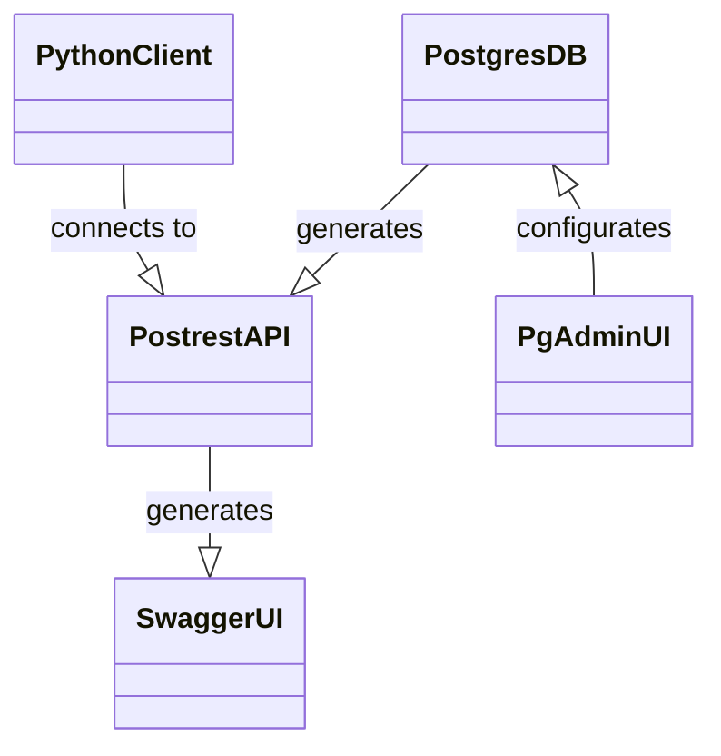

# HI ERN Database Postgres-Stack

Docker-Compose stack consisting of:
- [PostgreSQL](https://www.postgresql.org/)
- [PostgREST](https://postgrest.org/)
- [SwaggerUI](https://swagger.io/tools/swagger-ui/)
- [pgAdmin](https://www.pgadmin.org/)



PythonClient: https://git.hte.group/hierndatabase/hiern-database-pgstack-pyclient

## Config

```bash
cp .env.example .env
```
Set ENV values in `.env`

## Usage

```bash
docker compose up
```

## Cleanup

```bash
docker compose down -v
sudo rm -r postgres/data && sudo rm -r pgadmin/data
```
