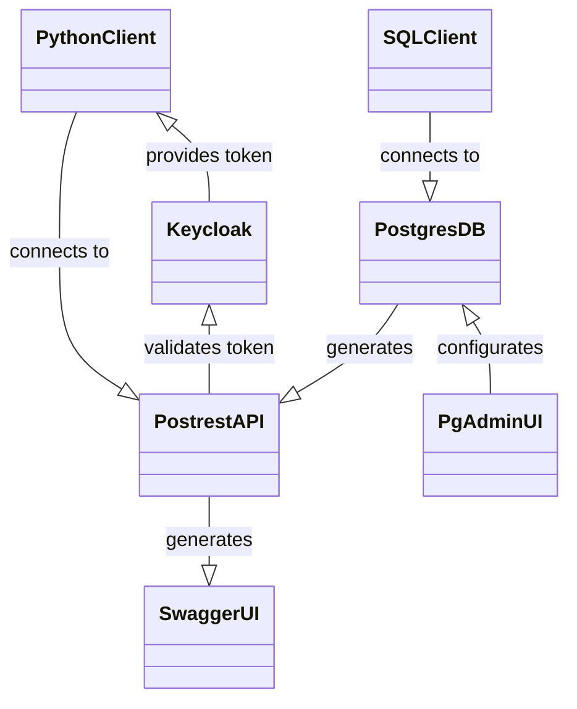

# Timescale-DB Postgres-Stack

Docker-Compose stack consisting of:
- [PostgreSQL](https://www.postgresql.org/)
- [PostgREST](https://postgrest.org/)
- [SwaggerUI](https://swagger.io/tools/swagger-ui/)
- [pgAdmin](https://www.pgadmin.org/)
- [Keycloak](https://www.keycloak.org/)


```mermaid
classDiagram
    PostgresDB --|> PostrestAPI : generates
    PostrestAPI --|> SwaggerUI : generates
    PostgresDB  <|-- PgAdminUI : configurates
    PythonClient --|> PostrestAPI : connects to
    PythonClient <|-- Keycloak : provides token
    Keycloak <|-- PostrestAPI : validates token
    SQLClient --|> PostgresDB : connects to
```


As reverse proxy, caddy is recommended. To use it, create the following docker compose within the same or a separate stack:
```yml
services:
  caddy:
    environment:
    - CADDY_INGRESS_NETWORKS=caddy
    image: lucaslorentz/caddy-docker-proxy:ci-alpine
    networks:
    - caddy
    ports:
    - 80:80
    - 443:443
    restart: unless-stopped
    volumes:
    - /var/run/docker.sock:/var/run/docker.sock
    - caddy_data:/data

volumes:
  caddy_data: {}
networks:
  caddy:
    external: true
``` 

In `docker-compose.example.override.yml` you can find the necessary definitions to expose the different containers via caddy.

## Config

```bash
cp .env.example .env
```
Set ENV values in `.env`

## Usage

```bash
docker compose up
```

## Cleanup

```bash
docker compose down -v
sudo rm -r postgres/data && sudo rm -r pgadmin/data
sudo mkdir pgadmin/data && sudo chown -R 5050:5050 pgadmin/data
mkdir pgadmin/config
```

## Auth

### Static JWT

see: https://postgrest.org/en/v12/tutorials/tut1.html#step-2-make-a-secret
```bash
echo "jwt-secret = \"$(LC_ALL=C tr -dc 'A-Za-z0-9' </dev/urandom | head -c32)\""
```
goto https://jwt.io/ and sign token with header `{"alg": "HS256", "typ": "JWT"}` and payload `{"role": "api_user"}`

Example token: `Bearer eyJhbGciOiJIUzI1NiIsInR5cCI6IkpXVCJ9.eyJyb2xlIjoiYXBpX3VzZXIifQ.<signature>`

set the jwt-secret in your `.env` file: 
```env
PGRST_JWT_SECRET=aAdsdasd...
PGRST_ROLE_CLAIM_KEY='role'
```

### Keycloak
Go to `https://auth.<domain>/admin/master/console/#/master/realm-settings/keys`

Copy public key for RSA RS256 algorithm.

Wrap it in header/footer line and convert it via https://8gwifi.org/jwkconvertfunctions.jsp to a JWT.
Example:

```
-----BEGIN PUBLIC KEY-----
MIIBIjANBgkqhkiG9w0BAQEFAAOCAQ8AMIIBCgKCAQEA2WGSqwsD/8VS6CEPF7Bwknzk6u9SgdLoUtRYnyWlvAE4jDmx92ql4YEcGug+DXZy33EnpoL9mjSXrghuiKb1pNAI9sHcc863pkuBWm2S7/l/esJkTD8J1sUETfy4OH4IutjTmtwyHGhfi1rlI81a1E6vCcMNyh5vTCizjerHfP34jjXvnMHIDU4F51JmN9FVpwpKlk/2JXRyCesedTNiiPaHZXQDRltVQGputXClugyEs8o7y46RoieGlc6/FLPU1JJGlM7F52fOYmIjhDWzO54/PHlzVCGEpW5c8kxeLlBBfjaYyiSvLH5ScssmrjtD5+aqV8A9iKViZuu4zOQs1wIDAQAB
-----END PUBLIC KEY-----
```

```json
{"kty":"RSA","e":"AQAB","kid":"15f3d607-103c-49ec-9041-df9e0f9fa848","n":"2WGSqwsD_8VS6CEPF7Bwknzk6u9SgdLoUtRYnyWlvAE4jDmx92ql4YEcGug-DXZy33EnpoL9mjSXrghuiKb1pNAI9sHcc863pkuBWm2S7_l_esJkTD8J1sUETfy4OH4IutjTmtwyHGhfi1rlI81a1E6vCcMNyh5vTCizjerHfP34jjXvnMHIDU4F51JmN9FVpwpKlk_2JXRyCesedTNiiPaHZXQDRltVQGputXClugyEs8o7y46RoieGlc6_FLPU1JJGlM7F52fOYmIjhDWzO54_PHlzVCGEpW5c8kxeLlBBfjaYyiSvLH5ScssmrjtD5-aqV8A9iKViZuu4zOQs1w"}
```

Store the JWT in your .env file
```env
PGRST_JWT_SECRET={"kty":"RSA","e":"AQAB","kid": "abc..."}
PGRST_ROLE_CLAIM_KEY='.resource_access.postgrest.roles[0]'
```

### Client

Go to "clients" and create a new one with name `postgrest`.
Choose access type "public", and define the redirecturi e.g. to `https://login.<domain>` for now.

Set the following settings:
```
Type: OpenID Connect
Name: postgrest
Authentication: Off
Flow: Implicite flow + Device Auth Grant
```

Next define the role to access the POSTGREST-API and the corresponding user group:
1. Create Client role "api_user"
1. Create Group "api_users"
1. Assign role "api_user" to Group "api_users"

For testing, create the following ressources
1. Create user "testuser"
1. Set password "testpassword"
1. Let "testuser" join group "api_users"

Generated access token: see clients/postgrest/client_scopes/evaluate with testuser

```bash
curl  -X POST \
  'https://<KEYCLOAK_SERVER>/realms/master/protocol/openid-connect/token' \
  --header 'Accept: */*' \
  --header 'Content-Type: application/x-www-form-urlencoded' \
  --data-urlencode 'grant_type=password' \
  --data-urlencode 'client_id=postgrest' \
  --data-urlencode 'username=testuser' \
  --data-urlencode 'password=testpassword'
```

Optionally you can provide a minimal login page to allow users to request a token by replace to placeholders in `keycloak/config/login-page/index.template.html` and provide it via webserver at the configured redirect url.

If you use Caddy, you can configure the caddy docker-compose.yml as follows:
```yml
    # custom static files
    - <your_path>/keycloak/config/login-page:/var/www/html/login-page
    labels:
      caddy: <CLIENT_REDIRECT_URL>
      caddy.file_server: /*
      caddy.file_server.root: "/var/www/html/login-page"
```

## Deploy

```bash
sudo chown 1000:1000 ./postgres/data
docker compose up
```

## Server-side downsampling

`api.downsample_tool_channel(osw_tool, ch_id, ts_start, ts_end, max_points,
bin_size, method, edge_anchors)` buckets a tool channel with `time_bucket()` and
reduces each bucket with one of three strategies:

- `sample` (default): one real row nearest each bucket center, schema-agnostic.
- `average`: structure-preserving deep average of the numeric JSONB leaves,
  timestamped at the bucket center.
- `minmax`: the real argmin/argmax row of every numeric leaf per bucket, so
  spikes and the signal envelope survive. Returns up to two rows per bucket.

`average` and `minmax` fall back to `sample` for channels without a numeric
leaf. With `edge_anchors` the first and last returned rows are the window's
first/last real datapoints.

### Performance

The dataset-independent benefit is the **payload reduction**. Absolute query
times are planner- and hardware-dependent: the same query varies 2-3x (and
`minmax` more) across PostgreSQL versions, `work_mem` and available parallel
workers, so treat any millisecond figure as indicative and measure on your own
database. Payload measured with `benchmarks/bench_downsample.py` from
[opensemantic.base-python](https://github.com/OpenSemanticWorld-Packages/opensemantic.base-python),
100000 points per channel, `max_points=1000`. `scalar` stores `{"value": n}`,
`composite` a nested dict of two measurements.

| channel   | method  | rows returned | payload | vs raw     |
|-----------|---------|--------------:|--------:|------------|
| scalar    | raw     |        100000 | 10.7 MB | baseline   |
| scalar    | sample  |          1002 |  107 KB | ~100x less |
| scalar    | average |          1003 |  113 KB | ~95x less  |
| scalar    | minmax  |          2001 |  215 KB | ~50x less  |
| composite | raw     |        100000 | 15.5 MB | baseline   |
| composite | sample  |          1002 |  155 KB | ~100x less |
| composite | average |          1003 |  160 KB | ~97x less  |
| composite | minmax  |          2001 |  310 KB | ~50x less  |

Reading this:

- Every strategy shrinks the payload ~50-100x, which is the point of
  downsampling: a dashboard transfers ~0.1 MB instead of ~10-15 MB.
- `sample` is the cheapest by far and is the right default for line plots.
  `average` and `minmax` walk every numeric leaf of every row in the window, so
  their cost scales with the rows scanned, not with `max_points`; `minmax`
  (argmin/argmax of each leaf per bucket) is the most expensive.
- Downsampling only pays off when it replaces reading the *whole* series. A
  client that already caps its read (e.g. `limit=10000`) may find a capped
  full-resolution read cheaper than `minmax` over a large window.
- Cost tracks the rows scanned, so a narrow, realistic time range matters more
  than a small `max_points`. Over a window far wider than the stored data most
  buckets are empty and you get far fewer points than requested.

Schema details this relies on, all in
`postgres/config/optional/100_init_tsdb_schema.sql`:

- a `(ch, ts DESC)` index per tool table, so a channel-filtered read does not
  scan every channel in the time range (the hypertable itself only indexes `ts`);
- `GRANT EXECUTE` on `time_bucket` to `api_user`, since the RPC is SECURITY
  INVOKER. Without it the RPC fails with `permission denied for function
  time_bucket` and clients silently fall back to full-resolution reads;
- a `ROWS 1` estimate on `api._jsonb_numeric_leaves`. A set-returning plpgsql
  function defaults to an estimate of 1000 rows per call, so in the `minmax`
  LATERAL join the planner expected ~1000x the real leaf count and chose a
  serial big-sort. `ROWS 1` matches scalar data (one leaf per row) and lets it
  pick the parallel plan; it helps up to a few numeric leaves per row and mildly
  regresses past ~10, so raise it for genuinely many-leaf channels.

Tuning `minmax`: its windowing plans either as a parallel scan+sort or a single
serial big-sort, and which the planner picks is sensitive to the `ROWS` estimate
above, to `work_mem` (a *larger* `work_mem` can disable the parallel plan and
make it slower), and to `max_parallel_workers_per_gather`. If `minmax` is slow,
`EXPLAIN ANALYZE` it and check whether it ran parallel. For very large ranges the
structural fix is TimescaleDB continuous aggregates (pre-computed rollups
maintained by background workers), which make the cost proportional to the
points returned rather than to the rows scanned.

## Maintenance

### Applying schema / endpoint changes to a running stack

The SQL under `postgres/config/*` (e.g. `postgres/config/optional/100_init_tsdb_schema.sql`,
which defines the tool endpoints and the `api.downsample_tool_channel` RPC) is
mounted into `/docker-entrypoint-initdb.d/`. The Postgres entrypoint runs those
scripts **only when it initializes an empty data directory** (first start). On an
already-initialized container it logs `... Skipping initialization` and never
sources them, so:

- `docker compose up` / `docker restart` does **not** re-run the init SQL.
- Editing a mounted `.sql` file has **no effect** on the running DB.

To pick up new or changed schema / endpoints without wiping data, apply the SQL
manually and reload PostgREST's schema cache. The init SQL is written to be
idempotent (`CREATE EXTENSION/TABLE IF NOT EXISTS`, and a `DROP ... IF EXISTS`
before every `CREATE OR REPLACE` function / aggregate / view), so it is safe to
re-run on a live database:

```bash
# 1. Apply the (idempotent) schema, incl. any new endpoints, to the live DB.
#    Run as the superuser so object ownership and the GRANTs re-apply.
docker exec -i postgres_container sh -c \
  'psql -v ON_ERROR_STOP=1 -U "$POSTGRES_USER" -d "$POSTGRES_DB"' \
  < postgres/config/optional/100_init_tsdb_schema.sql

# 2. Make PostgREST expose the changes (reload its schema cache).
docker exec -i postgres_container sh -c \
  'psql -U "$POSTGRES_USER" -d "$POSTGRES_DB" -c "NOTIFY pgrst, '\''reload schema'\'';"'
#    alternative: docker restart postgrest_container
```

Verify a function is present in the exposed schema, e.g.:

```bash
docker exec postgres_container sh -c \
  'psql -U "$POSTGRES_USER" -d "$POSTGRES_DB" -c "\df api.<function_name>"'
```

Until step 2 runs, PostgREST keeps returning "function not found" for a new RPC;
clients that call it should fall back to a full-resolution read in the meantime.

### Reset

```bash
docker compose down -v
sudo rm -R postgres/data/*
```

### Backup

```bash
cd <path-to-tsdb-docker-compose-filder>
mkdir backup
docker compose exec postgres /bin/bash -c 'pg_dump -U postgres -F p postgres 2>/dev/null | gzip | base64 -w 0' | base64 -d > backup/backup_$(date +"%Y%m%d_%H%M%S").sql.gz
```

### Restore
```bash
cd <path-to-tsdb-docker-compose-filder>
zcat backup/db_backup_<date>.sql.gz | docker exec -i <container_name> psql -U postgres -d postgres
```